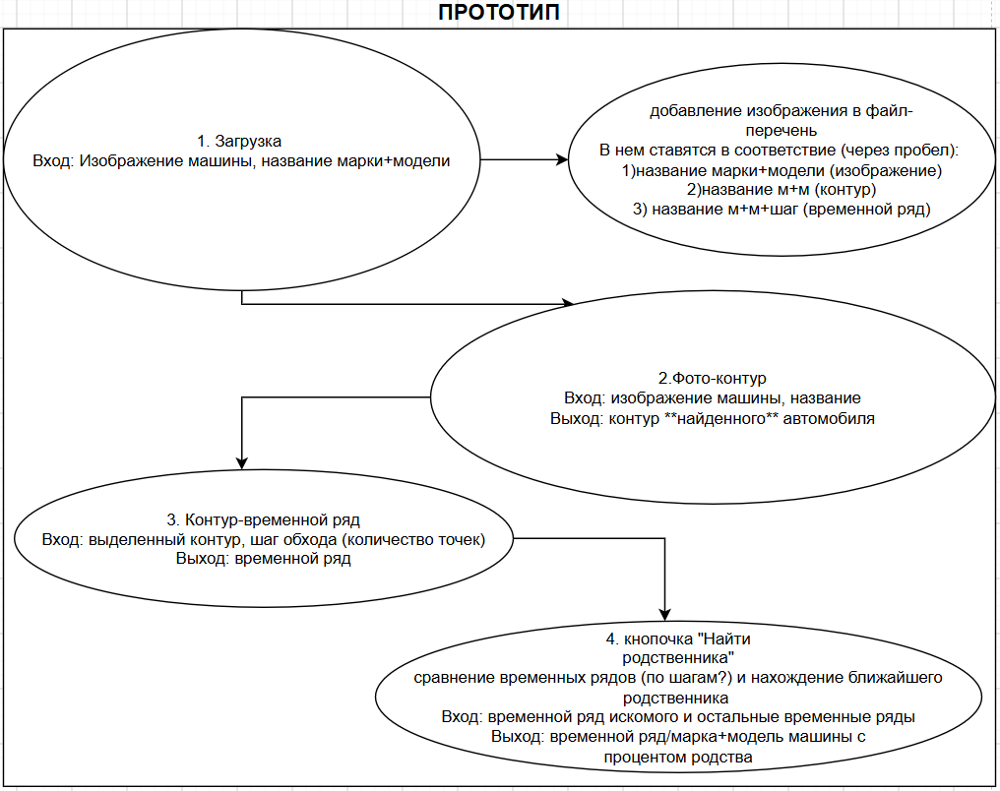

# CHETA notAI --- реализация проекта, связанного с идентификацией автомобилей по контуру

### РУКОВОДИТЕЛЬ ПРОЕКТА ---
Роли участников:
1. Денисова Полина (Git: https://github.com/bully_mi...) -  
2. Ермакова Софья (Git: https://github.com/milhobb) -  
3. Неделько Иван (Git: https://github.com/ivkinpro-rgb) - 
4. Палеева Виктория (Git: https://github.com/star-tea21) -
5. Смирнова Диана (Git: https://github.com/star-tea21) -  

## ТЕКУЩЕЕ ПРЕДСТАВЛЕНИЕ ПРОЕКТА

### ПОДОПИСАНИЕ КАЖДОГО ПУНКТА  

### CСЫЛКИ НА СТАТЬИ
