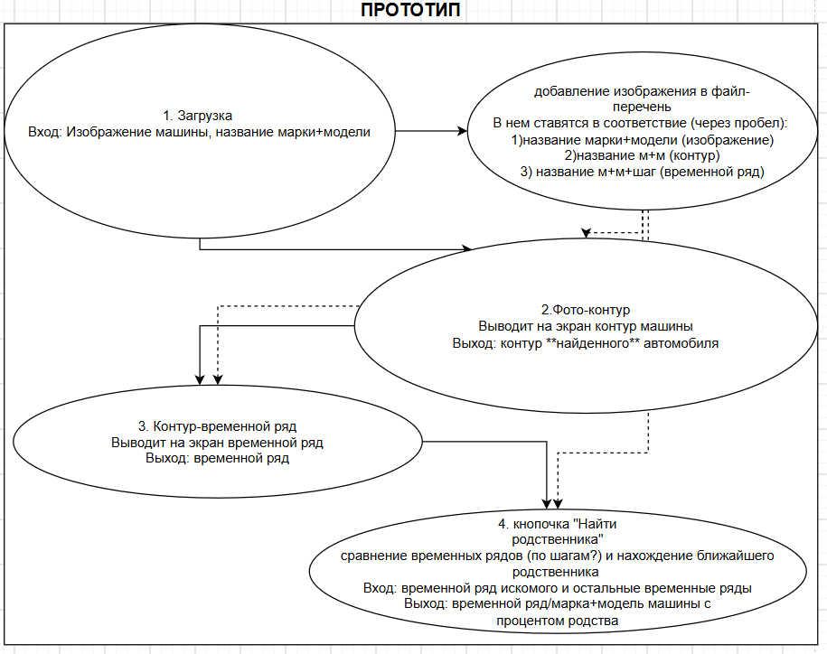

# CHETA notAI --- реализация проекта, связанного с идентификацией автомобилей по контуру

### РУКОВОДИТЕЛЬ ПРОЕКТА Неделько Иван
Роли участников:
1. Денисова Полина (Git: https://github.com/bullymichael) -  
2. Ермакова Софья (Git: https://github.com/milhobb) -  
3. Неделько Иван (Git: https://github.com/ivkinpro-rgb) - 
4. Палеева Виктория (Git: https://github.com/star-tea21) -
5. Смирнова Диана (Git: https://github.com/dianasmirnova83235-cloud) -  

## ТЕКУЩЕЕ ПРЕДСТАВЛЕНИЕ ПРОЕКТА

Расположение проекта: веб (streamlit) или декстоп (gui).

### ПОДОПИСАНИЕ КАЖДОГО ПУНКТА  

* Кнопка загрузка: берём фото, и загружаем его в папку бд на нашем ноутбуке.

  Файл: просто проверка для фото, есть ли для него файлы контур и/или временной ряд с таким же названием (условно image БМВ jpg, есть ли time_series БМВ jpg)
  Вопрос: если мы сделаем бд только с временными рядами, то возможно это по-другому будет реализовано (но тогда кнопка просто загрузки фото без сиюминутной переделки в контур, а потом во временной ряд не нужна)

* Кнопка контур: делаем контур машины (скорее всего как 1 вариант, так как самый легкий, но зависит от выбора инструмента ещё), уже возможные варианты реализации через OpenCV, rembg.

* Кнопка временной ряд: переделываем во временной ряд по алгоритму (пока не придумали как, центроид ищем (с помощью OpenCV мб) и т.д.).

* Кнопка сравнение: ищем максимально похожие топ-5 машин в процентах по схожести и выводим результат.

### CСЫЛКИ НА СТАТЬИ
